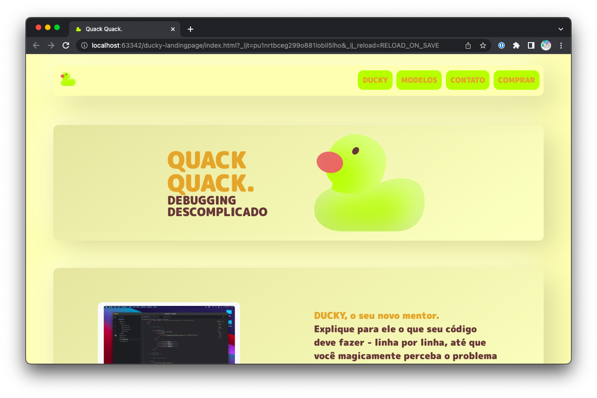

# Simple Landing Page - Ducky 
This is a simple landing page that I created to learn HTML, CSS and JavaScript. It includes a few basic features such as a navigation bar, a hero image, and simple buttons with a Neumorphic UI.

## Features
* Newmorphic, Minimalist and Modern Design
* Navigation bar with links to the different sections of the page
* Hero image with test
* Call-to-action buttons
* Responsive design (not ready for mobile yet...)